### [ES] Modelos de Deep Learning para dispositivos moviles offline para el [Parque Nacional de Tierra del Fuego (P.N.T.D.F), Argentina](https://www.argentina.gob.ar/interior/ambiente/parquesnacionales/tierradelfuego)

Este repositorio contiene el entrenamiento de 6 modelos de clasificacion de imagenes de Deep Learning utilizando Pytorch.
Los 6 modelos entrenados son:
* MobileNetV3:
   - Large
   - Small
* EfficientNetV2:
   - Large
   - Medium
   - Small
* Vision Transformer Base

Los modelos clasifican 24 especies de flores.
<div style="display: flex; flex-direction: row; flex-wrap: wrap; gap: 8px;">
   <div style="display: flex; flex-direction: column; gap: 4px">
      <label>Anemona</label>
      
   </div>
   <div style="display: flex; flex-direction: column; gap: 4px">
      <label>Barba de viejo</label>
      
   </div>
   <div style="display: flex; flex-direction: column; gap: 4px">
      <label>Cachiyuyo</label>
      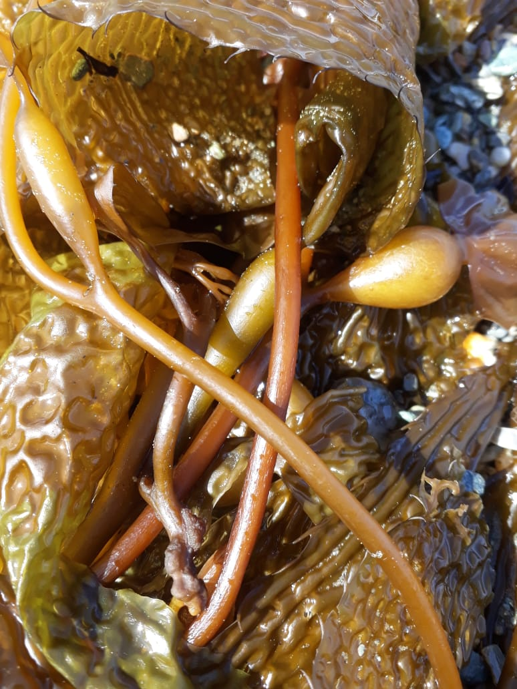
   </div>
   <div style="display: flex; flex-direction: column; gap: 4px">
      <label>Cadillo</label>
      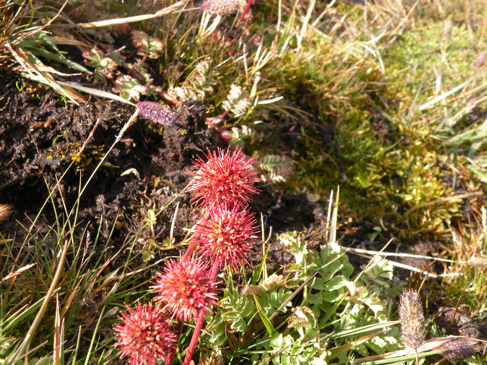
   </div>
   <div style="display: flex; flex-direction: column; gap: 4px">
      <label>Calafate</label>
      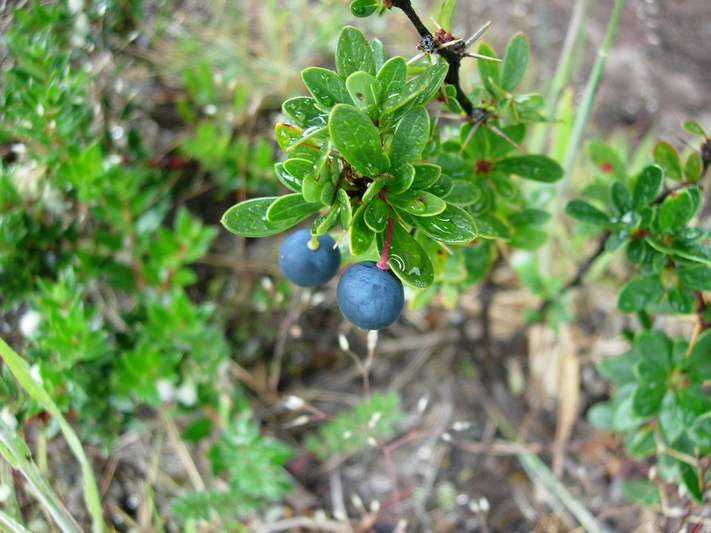
   </div>
   <div style="display: flex; flex-direction: column; gap: 4px">
      <label>Canelo</label>
      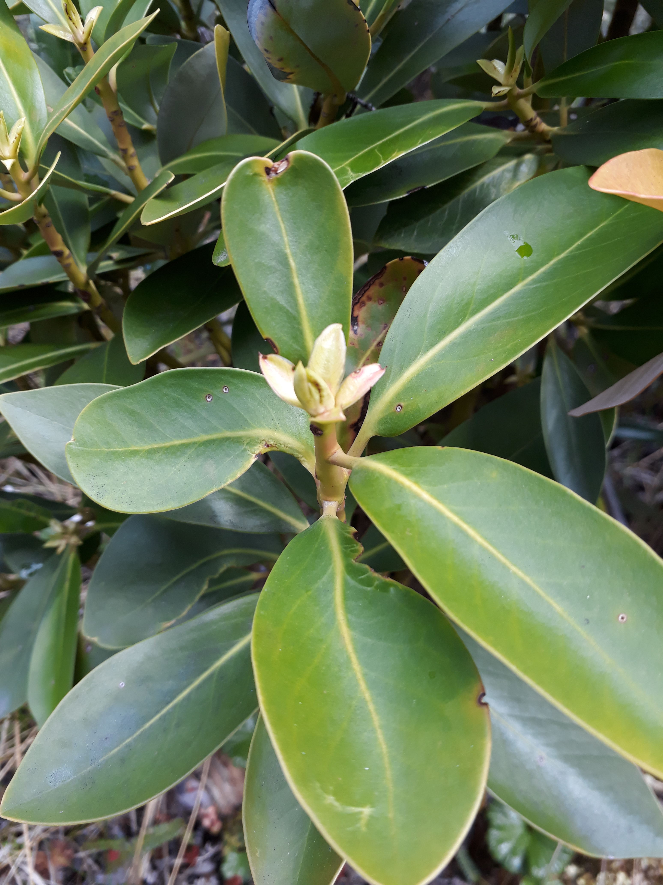
   </div>
   <div style="display: flex; flex-direction: column; gap: 4px">
      <label>Chaura</label>
      
   </div>
   <div style="display: flex; flex-direction: column; gap: 4px">
      <label>Frutilla del diablo</label>
      
   </div>
   <div style="display: flex; flex-direction: column; gap: 4px">
      <label>Frutilla silvestre</label>
      
   </div>
   <div style="display: flex; flex-direction: column; gap: 4px">
      <label>Guindo</label>
      
   </div>
   <div style="display: flex; flex-direction: column; gap: 4px">
      <label>Leña dura</label>
      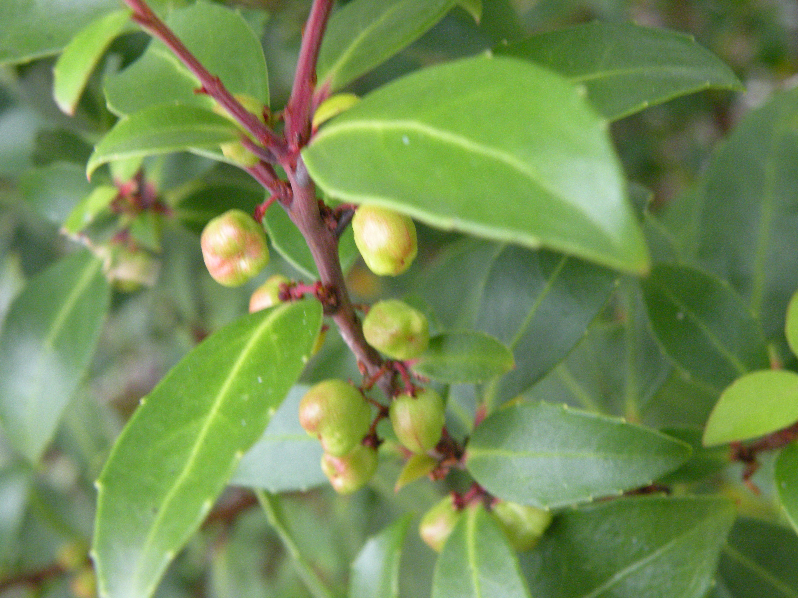
   </div>
   <div style="display: flex; flex-direction: column; gap: 4px">
      <label>Lenga</label>
      
   </div>
   <div style="display: flex; flex-direction: column; gap: 4px">
      <label>Maiten enano</label>
      
   </div>
   <div style="display: flex; flex-direction: column; gap: 4px">
      <label>Matanegra</label>
      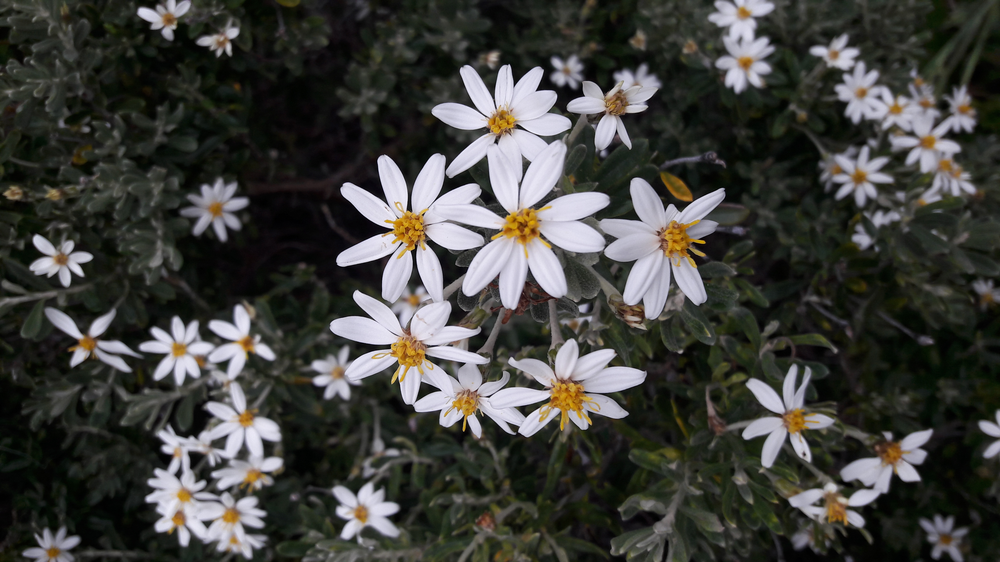
   </div>
   <div style="display: flex; flex-direction: column; gap: 4px">
      <label>Michay</label>
      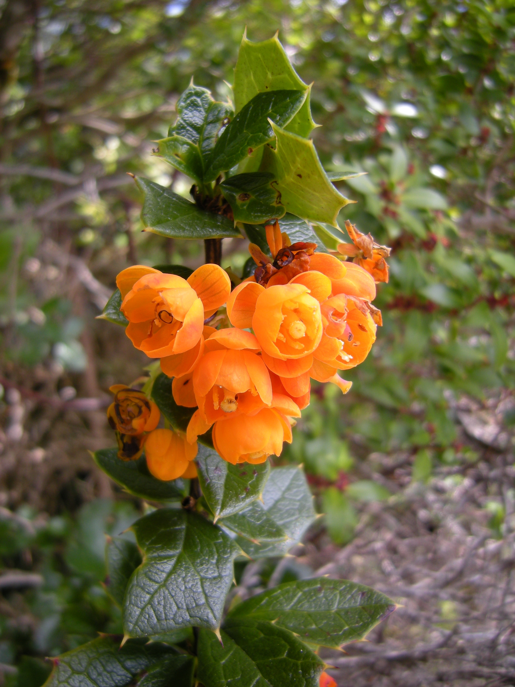
   </div>
   <div style="display: flex; flex-direction: column; gap: 4px">
      <label>Murtilla</label>
      
   </div>
   <div style="display: flex; flex-direction: column; gap: 4px">
      <label>Ñire</label>
      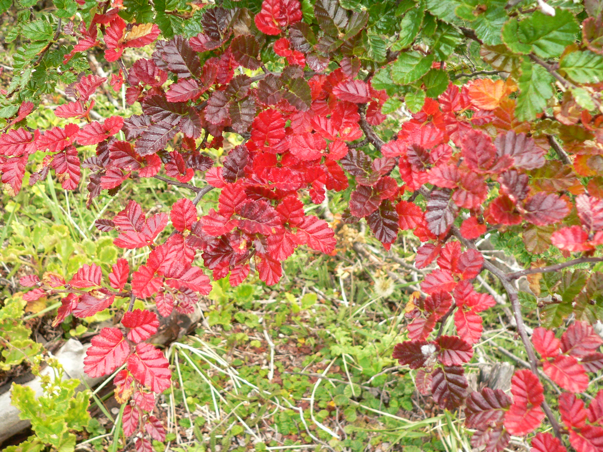
   </div>
   <div style="display: flex; flex-direction: column; gap: 4px">
      <label>Notro</label>
      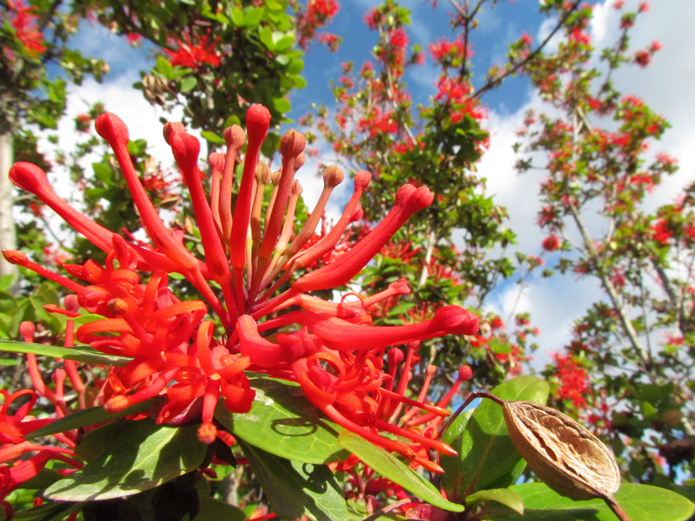
   </div>
   <div style="display: flex; flex-direction: column; gap: 4px">
      <label>Orquídea amarilla</label>
      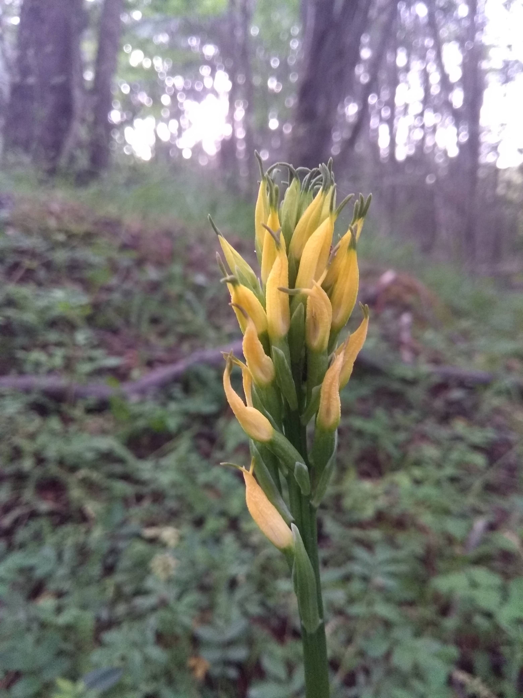
   </div>
   <div style="display: flex; flex-direction: column; gap: 4px">
      <label>Palomita</label>
      
   </div>
   <div style="display: flex; flex-direction: column; gap: 4px">
      <label>Parrilla</label>
      
   </div>
   <div style="display: flex; flex-direction: column; gap: 4px">
      <label>Perezia azul</label>
      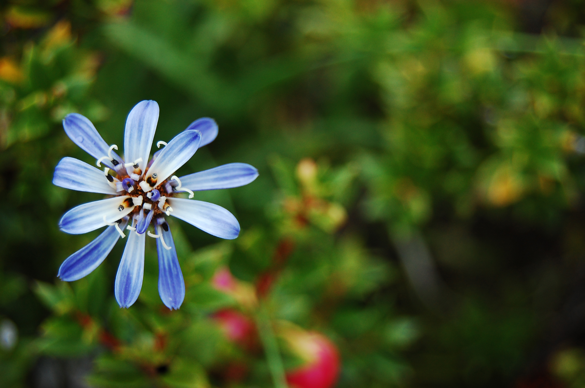
   </div>
   <div style="display: flex; flex-direction: column; gap: 4px">
      <label>Punque</label>
      
   </div>
   <div style="display: flex; flex-direction: column; gap: 4px">
      <label>Violeta amarilla</label>
      
   </div>
</div>

#### Pasos para correr el proyecto

1. Crear un entorno de desarrollo virtual (venv, pipenv, conda). Los siguientes pasos seran ejemplificados con virtualenv y MacOS
```bash
python3 -m venv {nombre_entorno}
```
2. Activar el entorno de desarrollo virtual
```bash
source venv/bin/activate
```
3. Instalar los requerimientos del proyecto
```
pip install -r requirements.txt
```
4. Con estos pasos el proyecto ya puede correr localmente en Jupyter Notebook (interfaz web o VSCode).

Nota: Esto toma en cuenta como precondicion haber descargado el [dataset](https://huggingface.co/datasets/brianrigoni/pntdf-flores).


### [EN]  Deep Learning Models for offline mobile devices for the [Tierra del Fuego National Park (PNTDF), Argentina](https://www.argentina.gob.ar/interior/ambiente/parquesnacionales/tierradelfuego)

This repository contains the training of 6 deep learning image classification models using Pytorch.
The 6 trained models are:
* MobileNetV3:
   - Large
   - Small
* EfficientNetV2:
   - Large
   - Medium
   - Small
* Vision Transformer Base

These models classify 24 species of flowers:
* anemona
* barba de viejo
* cachiyuyo
* cadillo
* calafate
* canelo
* chaura
* flor de papel
* frutilla del diablo
* frutilla silvestre
* guindo
* leña dura
* lenga
* maiten enano
* matanegra
* michay
* murtilla
* nire
* notro
* orquidea amarilla
* palomita
* parrilla
* perezia azul
* punque
* violeta amarilla


### [DE] Deep Learning-Modelle für offline mobile Geräte für den [Nationalpark Tierra del Fuego (PNTDF), Argentinien](https://www.argentina.gob.ar/interior/ambiente/parquesnacionales/tierradelfuego)

Dieses Repository enthält das Training von 6 Deep-Learning-Bildklassifikationsmodellen unter Verwendung von PyTorch.

Die 6 trainierten Modelle sind:
* MobileNetV3:
   - Large
   - Small
* EfficientNetV2:
   - Large
   - Medium
   - Small
* Vision Transformer Base

Diese Modelle klassifizieren 24 Arten von Blumen:
* anemona
* barba de viejo
* cachiyuyo
* cadillo
* calafate
* canelo
* chaura
* flor de papel
* frutilla del diablo
* frutilla silvestre
* guindo
* leña dura
* lenga
* maiten enano
* matanegra
* michay
* murtilla
* nire
* notro
* orquidea amarilla
* palomita
* parrilla
* perezia azul
* punque
* violeta amarilla
